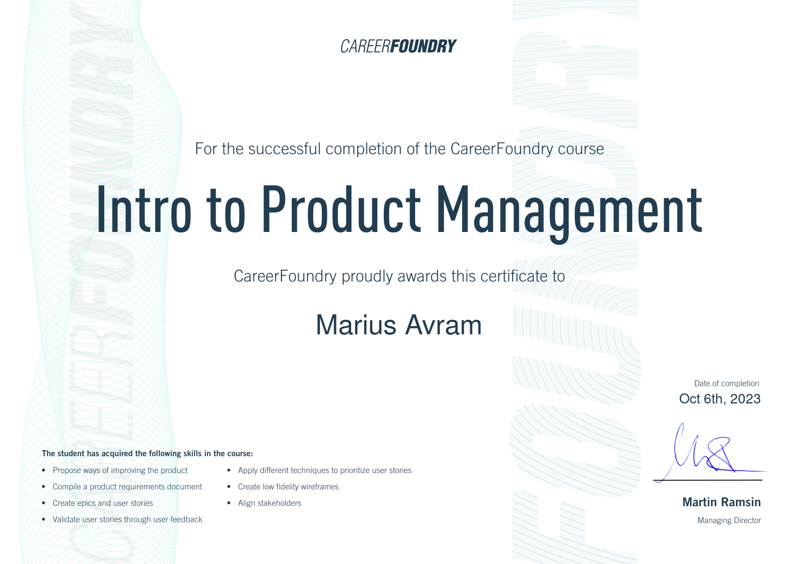

# CareerFoundry Product Management Course

## Intro Course - MakeYourMaps App (maps and local guide app)

Achievement 1: Intro To Product Management

[Exercises](/intro/) (PRD, Personas, Wireframing, Roadmapping, Team Alignment, Prioritisation, User Stories)

1. The Role of the Product Manager
2. Product Requirements Document
3. Agile: Scrum and Kanban
4. User and Market Research
5. Backlog Prioritisation
6. Design, Prototypes, MVPs
7. Team Alignment

## Immersion Course - Sync App (video conferencing app)

Achievement 1: Understand Your Product & Align the Team

[Exercises](/main/1) (Vision & Mission, Stakeholders, Product Principles, Problem Statement, Timeline & Budgets, Roadmapping)

1. Understanding Company Vision
2. Understanding Stakeholders and Decision Makers
3. Understanding the Product
4. Creating Product Principles
5. Aligning Project Timelines and Budgets
6. Creating a Product Roadmap